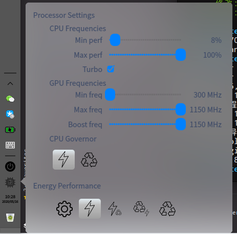

# Intel pstate dock plugin for Deepin V20

> * This project is heavily inspired by **plasma-pstate**([https://github.com/jsalatas/plasma-pstate](https://github.com/jsalatas/plasma-pstate)).
> * This project use the **UI Design** and the main script **set_pref.sh** of **plasma-pstate**
> * Please read the readme of **plasma-pstate** for using Intel pstate

### Screenshot



### Install

#### From release

Download deb file from release and install it with `sudo apt install /path/to/dde-pstate.deb`

#### Build from source

```shell script
git clone https://github.com/SeptemberHX/dde-pstate.git
cd dde-pstate
mkdir build
cd build
cmake ..
sudo make install
``` 

<div>Icons made by <a href="https://www.flaticon.com/authors/freepik" title="Freepik">Freepik</a> from <a href="https://www.flaticon.com/" title="Flaticon">www.flaticon.com</a></div>
